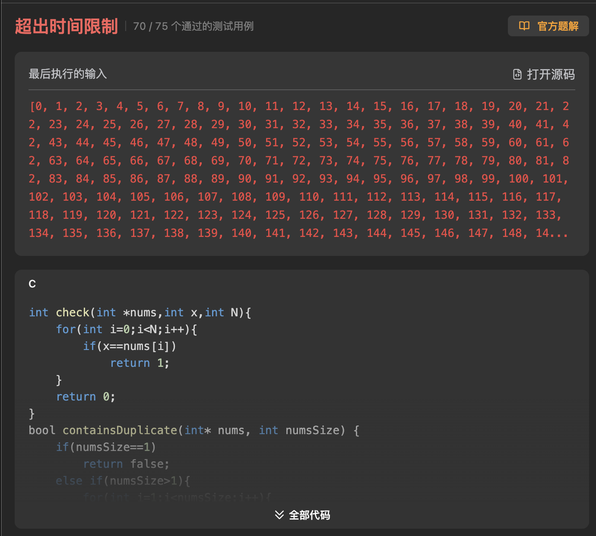

# T217
This is not a hard problem,but it has something to pay attention to.

### The first way 
to vertify if there has the repeatedly appearance elements,I add a `int check (int *nums,int x,int N)`function to traversal the orignal array.But it has the problem that the running time is out of the range.


> But my algorithm is true.
```C
//Here my code
int check(int *nums,int x,int N){
    for(int i=0;i<N;i++){
        if(x==nums[i])
            return 1;
    }
    return 0;
}
bool containsDuplicate(int* nums, int numsSize) {
    if(numsSize==1)
        return false;
    else if(numsSize>1){
        for(int i=1;i<numsSize;i++){
            if(check(nums,nums[i],i))
                return true;
        }
    }
    return false;
}
```
### The second way
I come up with the Hash set, but it has a problem that,`10^(-9)<nums[i]<10^9`,it may cause too much memory waste.stack-flow!


### The Third way 
It is provided by the Leetcode.The algorithm is bubble sort.The complexity is $O(N^2)$.To see if it has the repeated elements when traversal comparision.

```C
//Here is the code
void swap(int *a,int *b){
    int temp=*a;
    *a=*b;
    *b=temp;
}

bool containsDuplicate(int* nums, int numsSize){
    int i,j;
    bool flag=false;
    for(i=0;i<numsSize-1;i++){
        for(j=numsSize-1;j>i;j--){
            if(nums[j]<nums[j-1]){
                swap(&nums[j],&nums[j-1]);
                flag=true;
            } 
            if(nums[j]==nums[j-1])
                return true;
        }
        if(flag==false)//If these turn to traversal comparion no swap.It shows that there is no repeated element.
            return false;
            }
    return false;
}
```